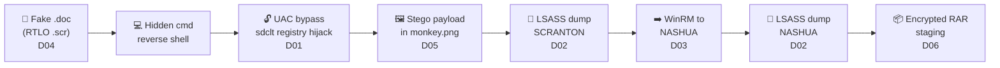
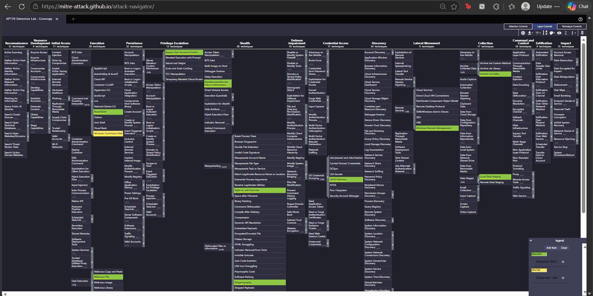
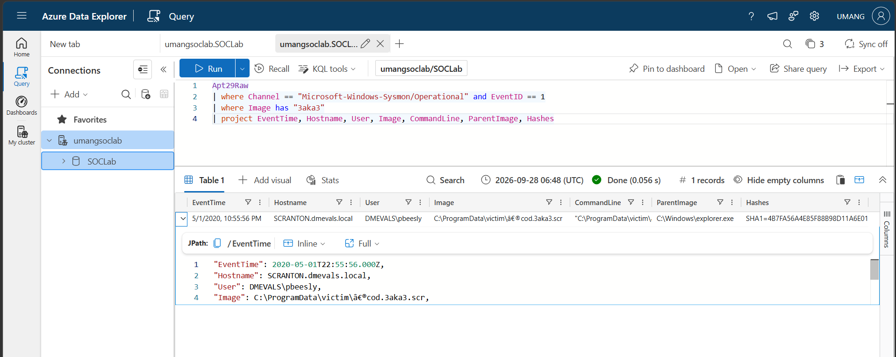
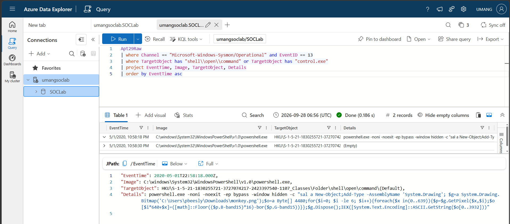
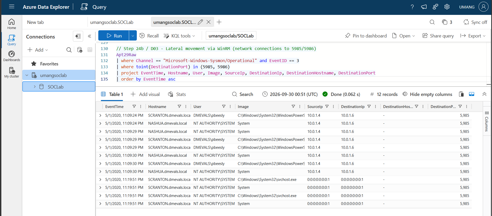
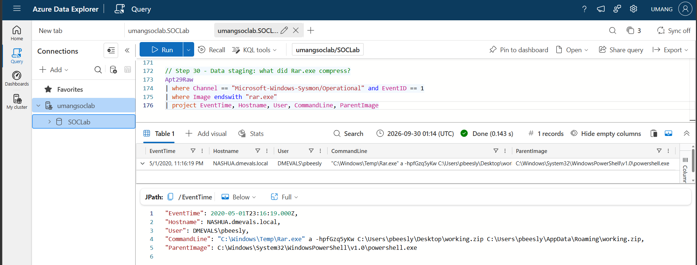

# 🛡️ APT29 Detection Lab

**Hunting a nation-state intrusion end-to-end with KQL - from a disguised phishing file to encrypted data staging - and turning every attacker step into a tested detection.**


---

## 📌 Summary

Using **196,081 real Windows events** recorded during an emulated **APT29 (Cozy Bear)** attack, I investigated the full intrusion as a SOC analyst would, reconstructed the attack timeline across **two compromised hosts**, and built **six detections** - each tested against the full dataset with **zero false positives**.

| | |
|---|---|
| **Dataset** | [OTRF Security-Datasets](https://github.com/OTRF/Security-Datasets) - APT29 Evals Day 1 |
| **Platform** | Azure Data Explorer (KQL - same engine and language as Microsoft Sentinel / Defender) |
| **Telemetry** | Sysmon, Windows Security auditing, PowerShell logging |
| **Outputs** | 6 detections · full hunting query log · incident report · ATT&CK coverage map |

---

## 🔗 Attack Chain Reconstructed



**~20 minutes** from first click (22:55 UTC) to data staged for theft (23:16 UTC).

---

## 🎯 Detections

| ID | Detection | ATT&CK | Data source | TP | FP |
|---|---|---|---|---|---|
| [D01](detections/D01-uac-bypass-registry-hijack.kql) | UAC bypass via registry hijack (sdclt / fodhelper / eventvwr family) | T1548.002 | Sysmon 13 | 2 | 0 |
| [D02](detections/D02-lsass-credential-dumping.kql) | Credential dumping from LSASS memory | T1003.001 | Sysmon 10 | 3 | 0 |
| [D03](detections/D03-winrm-lateral-movement.kql) | Lateral movement via PowerShell Remoting (WinRM) | T1021.006 | Sysmon 3 | 4 | 0 |
| [D04](detections/D04-rtlo-masquerading-scr.kql) | Right-to-left override masquerading / .scr execution | T1036.002, T1204.002 | Sysmon 1 | 1 | 0 |
| [D05](detections/D05-suspicious-powershell-risk-score.kql) | Hidden PowerShell - risk scoring of command-line indicators | T1059.001, T1027.003 | Sysmon 1 | 1 | 0 |
| [D06](detections/D06-encrypted-archive-staging.kql) | Data staging via encrypted archive | T1560.001, T1074.001 | Sysmon 1 | 1 | 0 |

Each rule includes ATT&CK mapping, severity, test results, known false positives and Essential Eight mitigations in its header.

---

## 🗺️ ATT&CK Coverage

🟩 Detected · 🟨 Observed - detection gap



👉 **[Open the interactive coverage map in MITRE ATT&CK Navigator](https://mitre-attack.github.io/attack-navigator/#layerURL=https%3A%2F%2Fraw.githubusercontent.com%2Fudeshiumang%2Fapt29-detection-lab%2Fmain%2Fdocs%2Fattack-navigator-layer.json)**

---

## 🔍 Investigation Highlights

**1. Initial access hidden in a filename.** Stack counting on process creation surfaced a `.scr` containing a hidden U+202E character - the user saw a `.doc`.


**2. Malware hidden inside an image.** The UAC bypass registry value contained PowerShell that rebuilt its payload from the **pixels of `monkey.png`** and ran it in memory - invisible to file-based antivirus.


**3. When process logs went quiet, network logs spoke.** Commands on NASHUA ran inside the WinRM session's memory, so no processes were created. Pivoting to Sysmon network events exposed PowerShell connecting SCRANTON → NASHUA on port 5985.


**4. The attacker's archive password was logged.** `Rar.exe` was run with `-hp` and the password on the command line - captured as an IOC.


**5. Data quality issue caught during validation.** The Security log appeared under both `Security` and `security` - an exact-match query would have silently missed **30%** of security events.

---

## 🇦🇺 Why This Matters in Australia

- Every finding is mapped to **ASD's Essential Eight** - application control, restricting admin privileges, user application hardening and MFA would each have broken this attack chain at a different stage.
- The investigation workflow - validate telemetry, hunt, pivot across data sources, build tested detections, report - reflects day-to-day work in Australian SOCs and MSSPs using Microsoft Sentinel and Defender.
- ASD is evolving the Essential Eight into a broader **Essentials** guidance series; outcome-based, threat-informed detection like this project aligns with that direction.

---

## 📂 Repository Structure

```
├── detections/        6 production-style KQL detections with metadata
├── docs/
│   ├── hunting-queries.kql          Full investigation, every query in order
│   └── attack-navigator-layer.json  ATT&CK coverage layer
├── report/
│   └── incident-report.md           Executive summary, timeline, IOCs, recommendations
└── screenshots/       Evidence for every finding
```

📄 **[Read the full incident report →](report/incident-report.md)**

---

## ♻️ Reproduce This Lab (free)

1. Create a free Azure Data Explorer cluster at [aka.ms/kustofree](https://aka.ms/kustofree) (Microsoft account only, no credit card).
2. Download `apt29_evals_day1_manual.zip` from [OTRF Security-Datasets](https://github.com/OTRF/Security-Datasets/tree/master/datasets/compound/apt29).
3. Ingest the JSON into a table named `Apt29Raw`.
4. Run [`docs/hunting-queries.kql`](docs/hunting-queries.kql) in order, then the rules in [`/detections`](detections).

---

## 🧠 Skills Demonstrated

`Threat hunting` · `KQL` · `Detection engineering` · `Sysmon analysis` · `Process tree analysis` · `MITRE ATT&CK mapping` · `Incident reporting` · `Essential Eight` · `Log validation & data quality`

---

## 👤 Author

**Umang Udeshi** - Master of Cybersecurity, RMIT University · BTL1 · ISC2 CC · Microsoft SC-900
Melbourne, Australia · Open to SOC / Security Analyst roles

[LinkedIn]([https://www.linkedin.com/in/YOUR-HANDLE](https://www.linkedin.com/in/umang-udeshi-877b40198/))
