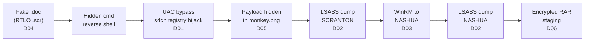

# APT29 Detection Lab

Hunting an emulated APT29 intrusion end-to-end with KQL, from a disguised phishing file to encrypted data staging, and turning each attacker step into a tested detection.


---

## Summary

I took 196,081 Windows events recorded during an emulated APT29 (Cozy Bear) attack and investigated them the way a SOC analyst would. I rebuilt the attack timeline across two compromised hosts and wrote six detections, each tested against the full dataset with no false positives.

| | |
|---|---|
| **Dataset** | [OTRF Security-Datasets](https://github.com/OTRF/Security-Datasets), APT29 Evals Day 1 |
| **Platform** | Azure Data Explorer (KQL, the same query language as Microsoft Sentinel and Defender) |
| **Telemetry** | Sysmon, Windows Security auditing, PowerShell logging |
| **Outputs** | 6 detections, full hunting query log, incident report, ATT&CK coverage map |

---

## Attack chain



21 minutes from the first click (22:55 UTC) to data staged for theft (23:16 UTC).

---

## Detections

| ID | Detection | ATT&CK | Data source | TP | FP |
|---|---|---|---|---|---|
| [D01](detections/D01-uac-bypass-registry-hijack.kql) | UAC bypass via registry hijack (sdclt / fodhelper / eventvwr family) | T1548.002 | Sysmon 13 | 2 | 0 |
| [D02](detections/D02-lsass-credential-dumping.kql) | Credential dumping from LSASS memory | T1003.001 | Sysmon 10 | 3 | 0 |
| [D03](detections/D03-winrm-lateral-movement.kql) | Lateral movement via PowerShell Remoting (WinRM) | T1021.006 | Sysmon 3 | 4 | 0 |
| [D04](detections/D04-rtlo-masquerading-scr.kql) | Right-to-left override masquerading / .scr execution | T1036.002, T1204.002 | Sysmon 1 | 1 | 0 |
| [D05](detections/D05-suspicious-powershell-risk-score.kql) | Hidden PowerShell, risk scoring of command-line indicators | T1059.001, T1027.003 | Sysmon 1 | 1 | 0 |
| [D06](detections/D06-encrypted-archive-staging.kql) | Data staging via encrypted archive | T1560.001, T1074.001 | Sysmon 1 | 1 | 0 |

Each rule file has the ATT&CK mapping, severity, test results, known false positives and mitigations in its header.

---

## ATT&CK coverage

Green = detected. Yellow = observed, no detection yet.


[Open the interactive coverage map in MITRE ATT&CK Navigator](https://mitre-attack.github.io/attack-navigator/#layerURL=https%3A%2F%2Fraw.githubusercontent.com%2Fudeshiumang%2Fapt29-detection-lab%2Fmain%2Fdocs%2Fattack-navigator-layer.json)

---

## Investigation highlights

**1. Initial access hidden in a filename.** Stack counting on process creation turned up a `.scr` with a hidden U+202E character in its name, so the user would have seen it as a `.doc`.


**2. Payload hidden inside an image.** The hijacked registry value held a PowerShell command that rebuilt its payload from the pixels of `monkey.png` and ran it in memory, so there was no malware file on disk for antivirus to scan.


**3. No processes on NASHUA, so I checked network logs.** The attacker's commands ran inside the WinRM session's memory, so process creation logs were empty. Sysmon network events showed PowerShell on SCRANTON connecting to NASHUA on port 5985.


**4. The archive password was in the logs.** `Rar.exe` was run with `-hp` and the password typed on the command line, so Sysmon captured it.


**5. A data quality issue caught during validation.** The Security log showed up as both `Security` and `security`. An exact-match query would have missed 30% of security events.

---

## Australian context

Every finding is mapped to ASD's Essential Eight. Application control, restricting admin privileges, user application hardening and MFA would each have broken this attack at a different stage. See the [incident report](report/incident-report.md) for the full mapping.

---

## What I learned

**Hardest part:** Getting the data in properly. I set up an explicit mapping to load each event into one column, but the upload wizard ignored it and created 147 columns on its own. I only noticed because my first queries came back empty. Since then, the first thing I do is check row counts against the source before trusting any data.

**What surprised me:** How much the attacker did without dropping files. The payload was hidden in the pixels of a PNG and the commands on NASHUA never started a single process. When my WinRM query returned zero rows I thought I'd made a mistake, but it was actually the attacker staying in memory. Switching to network logs is what found it.

**What I'd do next:** Build a detection for the hidden cmd.exe shell, which is still a gap on the coverage map. I also want to convert the rules to Sigma so they work outside Microsoft tools, and test them against the Day 2 data to see how many false positives show up on a noisier dataset.

---

## Repository structure

```
├── detections/        6 KQL detections with metadata
├── docs/
│   ├── hunting-queries.kql          Full investigation, every query in order
│   └── attack-navigator-layer.json  ATT&CK coverage layer
├── report/
│   └── incident-report.md           Summary, timeline, IOCs, recommendations
└── screenshots/       Evidence for each finding
```

[Read the full incident report](report/incident-report.md)

---

## Reproduce this lab (free)

1. Create a free Azure Data Explorer cluster at [aka.ms/kustofree](https://aka.ms/kustofree). It only needs a Microsoft account, no credit card.
2. Download `apt29_evals_day1_manual.zip` from [OTRF Security-Datasets](https://github.com/OTRF/Security-Datasets/tree/master/datasets/compound/apt29).
3. Ingest the JSON into a table named `Apt29Raw`.
4. Run [`docs/hunting-queries.kql`](docs/hunting-queries.kql) in order, then the rules in [`detections/`](detections).

---

## Author

**Umang Udeshi** - Master of Cybersecurity, RMIT University · BTL1 · ISC2 CC · Microsoft SC-900
Melbourne, Australia · Open to SOC / Security Analyst roles

[LinkedIn](https://www.linkedin.com/in/umang-udeshi-877b40198/)
